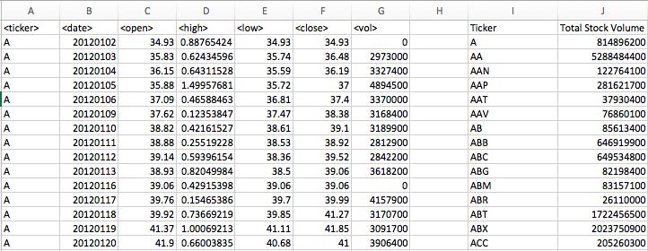

# VBA Stock Price Analysis
## Stock price analysis using Excel VBA macros

The beauty of automating repetitive tasks in Excel with VBA scripting is demonstrated in this analysis, which seeks to answer the following questions:

Which stock had the highest trading volume in each year? The lowest?
Which stock performed best in each year? The worst?

## Data Structure
The data began as an Excel workbook consisting of 5 spreadsheets, one for each year between 2012 and 2016.

Each spreadsheet consists of over half a million rows of data, one row representing a single stock's trading stats for one day. Each of the ~2,800 stock tickers on the NYSE takes up ~250 rows in each spreadsheet, one for each trading day of the year. Columns consist of:
* `ticker` - the stock ticker symbol
* `date` - the date for which the stock statistics are recorded
* `open` - the opening price of the stock
* `high` - the highest daily price of the stock
* `low` - the lowest daily price of the stock
* `close` - the closing price of the stock
* `vol` - the daily trading volume of the stock at close

## Testing Data
Because the dataset is so large, it was necessary to create a smaller set for testing. In order to cut down on processing time during writing and debugging the VBA script, the larger dataset was truncated to ~10,000 rows per spreadsheet.

This testing file is included in the repo, as `Raw_Stock_Data_Testing.xlsx`. Due to GitHub's 100MB file size limit, the larger raw dataset, as well as the completed analyzed workbook, is stored locally. Try  to download a similar dataset.

## 

